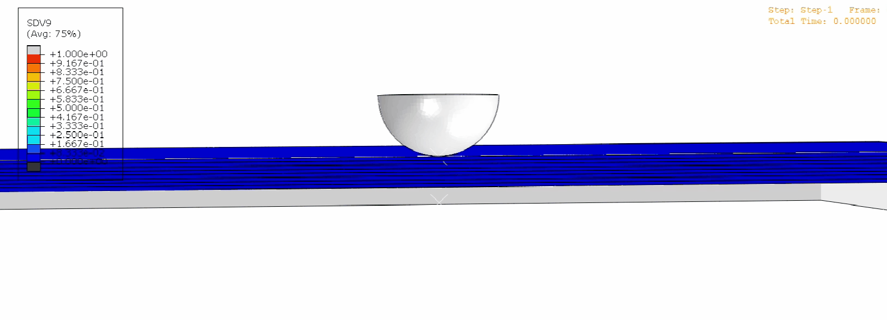

# 理论方法
## 复合材料失效演化 Hashin 准则
&emsp;&emsp;复合材料层合板在低速冲击后可能造成层合板多种内部损伤。从细观上看, 在层合板的子层内, 会出现纤维断裂(fiber fracture)、基体开裂(matrix crack)等损伤模式, 子层与子层之间还会出现分层(delamination)损伤。对于纤维和基体的损伤我们拟采用 Hashin 失效准则。 　　Hashin 准则是一种广泛应用于复合材料渐进失效分析的判据, 已经被 Abaqus、Ansys、MSC 等大型商业软件集成。无论中文还是外文, 关于使用 Hashin 准则进行复合材料失效分析的文章都非常丰富。Hashin 于 1980 年发表的一篇关于单向纤维增强复合材料失效准则的文章被引用了 3790 次。该准则最初用于预测单向复合材料的失效行为, 而现在已广泛应用于层压板的失效预测。

### 刚度退化矩阵：
$$
C_d=\frac1\Delta\begin{bmatrix}d_fE_{11}(1-d_{m}\nu_{23}\nu_{32})&d_{f}d_{m}E_{11}(\nu_{21}+\nu_{23}\nu_{31})&d_{f}E_{11}(\nu_{31}+d_{m}\nu_{21}\nu_{32})\\&d_{m}E_{22}(1-d_{f}\nu_{13}\nu_{31})&d_{m}E_{22}(\nu_{32}+d_{f}\nu_{12}\nu_{31})\\&&E_{33}(1-d_{f}d_{m}\nu_{12}\nu_{21})\\&&&\Delta d_{f}d_{m}S_{12}\\&&&&\Delta d_{f}d_{m}S_{23}\\&&&&&\Delta d_{f}d_{m}S_{13}\\\\\end{bmatrix}
$$
其中，$d_f$ / $d_m$ 是纤维和基体损伤变量，计算表达式如下：
$$
\left.\left\{\begin{matrix}d_f=(1-d_{ft})(1-d_{fc})\\[4pt] d_m=(1-S_{mt}d_{mt})(1-S_{mc}d_{mc})\\[4pt]\Delta=1-d_fd_m\nu_{12}\nu_{21}-d_m\nu_{23}\nu_{32}-d_f\nu_{13}\nu_{31}-2d_fd_m\nu_{21}\nu_{32}\nu_{13}\end{matrix}\right.\right.
$$
其中 $d_I$ 表示损伤变量，下标 “$ft$”、“$fc$”、“$mt$”、“$mc$” 分别表示纤维张力、纤维压缩、基体张力和基体压缩。

### 纤维拉伸：
$$
F_{mt}=\left(\frac{\hat{\sigma}_{22}}{Y^{T}}\right)^{2}+\left(\frac{\hat{\sigma}_{12}}{S^{L}}\right)^{2}=1\quad(\hat{\sigma}_{22}\geq0)
$$
### 纤维压缩：
$$
F_{mc}=\left(\frac{\hat{\sigma}_{22}}{2S^{T}}\right)^{2}+\left[\left(\frac{Y^{C}}{2S^{T}}\right)^{2}-1\right]\frac{\hat{\sigma}_{22}}{Y^{C}}+\left(\frac{\hat{\sigma}_{12}}{S^{L}}\right)^{2}=1\quad(\hat{\sigma}_{22}<0)
$$
### 基体拉伸：
$$
    F_{ft}=\left(\frac{\hat{\sigma}_{11}}{X^{T}}\right)^{2}+{\alpha}\left(\frac{\hat{\sigma}_{12}}{S^{L}}\right)^{2}=1\quad(\hat{\sigma}_{11}\geq0)
$$
### 基体压缩：
$$
    F_{fc}=\left(\frac{\hat{\sigma}_{11}}{X^{^{C}}}\right)^{2}=1\quad(\hat{\sigma}_{11}<0)
$$
### 基于能量的损伤演化
上述公式用于判断的是材料点的损伤起始, 比如当 $F_{ft}$ 达到 1 的时候, 表示该材料点纤维方向拉伸损伤刚刚开始, 小于 1 的时候, 材料纤维方向无拉伸损伤。$X^T$ 和 $X^C$ 分别表示纤维方向的拉伸强度和抗压强度；$Y^T$ and $Y^C$ 分别表示横向的拉伸强度和抗压强度；$S^L$ 和 $S^L$ 则为剪切强度。达到损伤起始准则后，损伤演化方式如下：
$$
d_{I}=\frac{\varepsilon_{I}^{e,f}}{\varepsilon_{I}^{e,f}-\varepsilon_{I}^{e,0}}(1-\frac{\varepsilon_{I}^{e,0}}{\varepsilon_{I}^{e}})\quad(d_{I}\in(0,1),I=ft,fc,mt,mc)
$$
其中，$\varepsilon_I^e(I=ft,fc,mt,mc)$ 是相应方向上的弹性应变；$\varepsilon_i^{e_if}(I=ft,fc,mt,mc)$ 是相应损伤变量达到 1 时的最终失效弹性应变。
$$
\begin{gathered}
\varepsilon_{ft}^{e,f}=\frac{2G_{ft}}{X^{T}l}\\[4pt]
\varepsilon_{fc}^{e,f}=\frac{2G_{fc}}{X^{C}l}\\[4pt]
\varepsilon_{mt}^{e,f}=\frac{2G_{mt}}{Y^{T}l}\\[4pt]
\varepsilon_{mc}^{e,f}=\frac{2G_{mc}}{Y^{C}l}
\end{gathered}
$$
$G_I(I=ft,fc,mt,mc)$ 是对应失效模式的断裂能量（纵向拉伸断裂能 $G_{ft}$,纵向压缩断裂能 $G_{fc}$，横向拉伸断裂能 $G_{mt}$，横向压缩断裂能 $G_{mc}$），即临界应变能释放率, 是裂纹扩展单位面积所需要的能量, 一般单位取为 $\mathrm{N/m}$, $\mathrm{J/m^2}$, $\mathrm{N/mm}$ 或 $\mathrm{mJ/mm^2}$；$l$ 是元素的特征长度，由相应元素体积的立方根计算得出。

三维hashin应变子程序模拟效果

图例中 SDV9 代表层合板的基体拉伸损伤

## 内聚模型方法
&emsp;&emsp;Cohesive zone model（CZM，内聚模型）是一种用于描述材料界面（例如层间界面）中裂纹扩展和损伤行为的方法。它是一种常用于研究复合材料、粘合剂、金属等材料界面行为的数值模型。CZM 也可用于描述在高周疲劳条件下的裂纹扩展和层间损伤。在高周疲劳加载条件下，材料往往会受到重复加载，并可能导致裂纹的扩展和损伤。CZM允许模拟这种过程，通过描述材料界面的强度和断裂行为，以及裂纹在材料界面中的扩展过程。

1. **裂纹扩展准则**：裂纹在材料界面中的扩展可以由某种裂纹扩展准则描述。一种常见的准则是根据应力强度因子 \(K\) 和断裂韧性 \(G_c\) 来描述裂纹扩展速率：

$$
\frac{{d a}}{{d N}} = \frac{{K^2}}{{G_c}}
$$

其中 $a$ 是裂纹长度，$N$ 是加载周期数。

2. **损伤演化规律**：损伤演化可以用某种损伤演化规律描述，通常是通过损伤演化参数来表示。一个简单的形式可能是：

$$
D = D_0 + \int \limits_{0}^{t} \dot{D}(t) dt
$$
其中，$D$ 是损伤程度，$D_0$ 是初始损伤程度，$\dot{D}(t)$ 是损伤速率。
